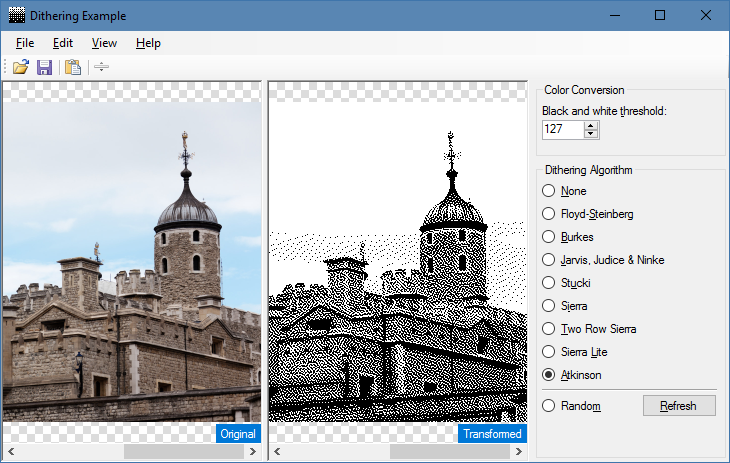

Image Dithering using C#
========================

This sample program demonstrates how to use various algorithms to dither an image using C#.

Please refer to the following articles on cyotek.com for more details

* [An introduction to dithering images](http://www.cyotek.com/blog/an-introduction-to-dithering-images)
* [Dithering an image using the Floyd–Steinberg algorithm in C#](http://www.cyotek.com/blog/dithering-an-image-using-the-floyd-steinberg-algorithm-in-csharp)
* [Dithering an image using the Burkes algorithm in C#](http://www.cyotek.com/blog/dithering-an-image-using-the-burkes-algorithm-in-csharp)
* [Even more algorithms for dithering images using C#](http://www.cyotek.com/blog/even-more-algorithms-for-dithering-images-using-csharp)

Resources
---------
`DHALF.TXT` was obtained from <http://www.efg2.com/Lab/Library/ImageProcessing/DHALF.TXT>  
`DITHER.TXT` was obtained from <http://cd.textfiles.com/graphics16000/FORMATS/GIF/DITHER2.TXT>

Referenced, but missing - if you find copies of these documents let [me know!](https://github.com/cyotek/Dithering/issues)

* BURKES.ARC
* NUDTHR.ARC
* IDTVGA.TXT
* DGIF.ZIP

